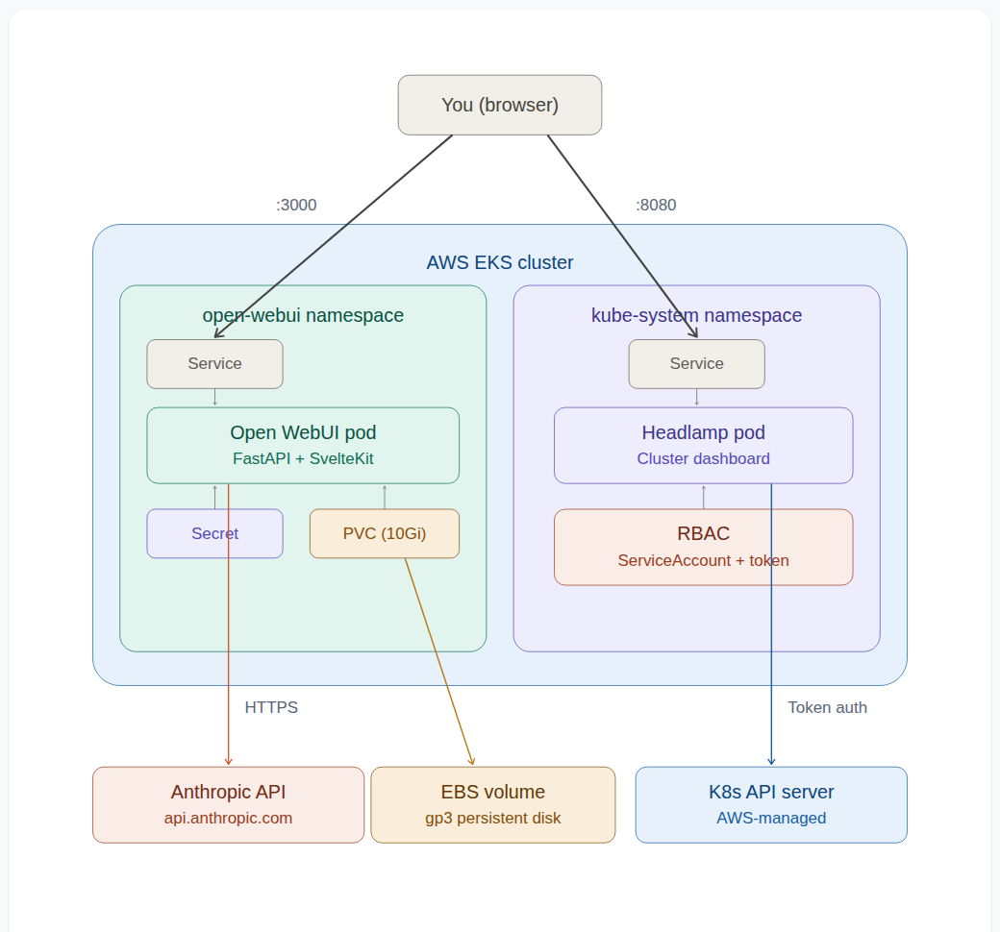
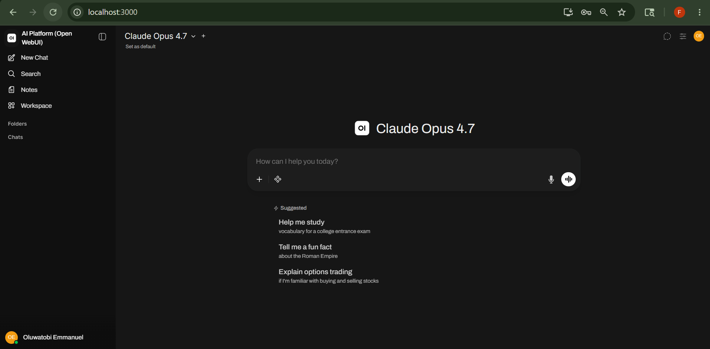
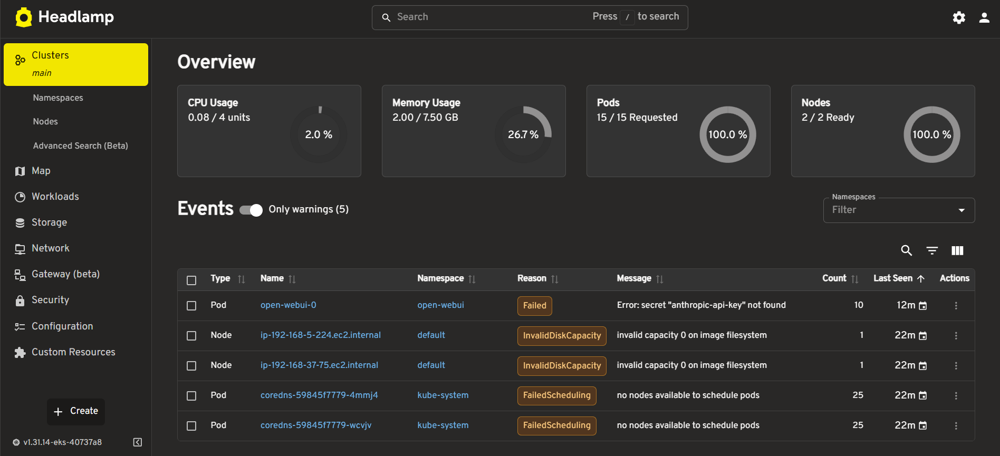
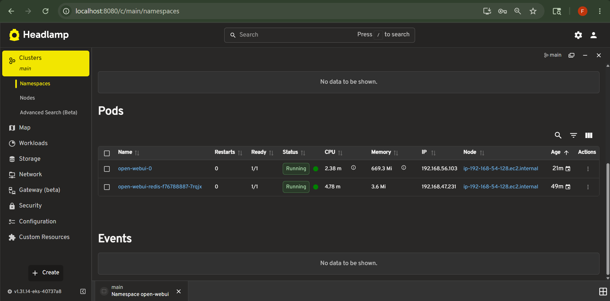

## AI Chat Platform on AWS EKS

Self-hosted AI chat platform deployed on AWS EKS with Open WebUI, Anthropic Claude API, and Headlamp dashboard.

## Architecture



At the top sits the user, accessing everything through the browser. Two port-forward tunnels connect directly to the Services inside the cluster: port 3000 to the Open WebUI Service and port 8080 to the Headlamp Service.

Inside the EKS cluster, two namespaces are clearly separated. On the left, the `open-webui` namespace holds the Open WebUI pod (FastAPI + SvelteKit), its Service, a Secret (Anthropic API key injected at runtime), and a PVC (10Gi of EBS-backed persistent storage for the SQLite database). On the right, the `kube-system` namespace holds the Headlamp pod, its Service, and the RBAC resources (ServiceAccount with a cluster-admin ClusterRoleBinding).

Three external connections sit outside the cluster. Open WebUI sends prompts to the Anthropic API over HTTPS. The PVC maps to an EBS volume (gp3 persistent disk that survives pod restarts). Headlamp authenticates with the Kubernetes API server (fully managed by AWS) using its service account token.

Open WebUI and Headlamp don't communicate with each other. They are two independent workloads in the same cluster. Headlamp observes Open WebUI's resources through the Kubernetes API, but there is no direct connection between them.

## Screenshots

### Open WebUI - AI Chat Interface


### Headlamp - Cluster Overview


### Headlamp - Open WebUI Namespace


## Tech Stack

- AWS EKS (Kubernetes 1.31)
- Terraform (infrastructure provisioning)
- Open WebUI (self-hosted AI chat interface)
- Anthropic Claude API
- Headlamp (Kubernetes dashboard)
- Helm 3
- AWS EBS CSI Driver + gp3 StorageClass

## Prerequisites

- AWS CLI configured with appropriate permissions
- Terraform (>= 1.0)
- kubectl
- Helm 3
- An Anthropic API key

## Quick Start

```bash
# Clone the repo
git clone https://github.com/tobifotis/eks-ai-platform.git
cd eks-ai-platform

# Deploy everything (takes ~15-20 minutes for cluster creation)
chmod +x scripts/setup.sh
./scripts/setup.sh

# Access Open WebUI
kubectl port-forward svc/open-webui -n open-webui 3000:80
# Open http://localhost:3000
# Enter your Anthropic API key in Admin Settings > Connections > gear icon

# Access Headlamp
kubectl port-forward svc/headlamp -n kube-system 8080:80
# Open http://localhost:8080
# Paste the token printed by the setup script
```

## Project Structure

```
eks-ai-platform/
├── README.md
├── terraform/                         # EKS cluster infrastructure
│   ├── main.tf                        # VPC, EKS, IAM modules
│   ├── variables.tf                   # Input variables
│   └── outputs.tf                     # Cluster outputs
├── helm-values/
│   ├── open-webui-values.yaml         # Helm overrides for Open WebUI
│   └── headlamp-values.yaml           # Helm overrides for Headlamp
├── k8s/
│   ├── storage-class.yaml             # gp3 StorageClass definition
│   └── headlamp-rbac.yaml             # ServiceAccount + ClusterRoleBinding
├── scripts/
│   ├── setup.sh                       # One-command deploy
│   └── cleanup.sh                     # One-command teardown
└── docs/
    ├── eks-ai-platform-architecture.png
    ├── headlamp-open-webui-namespace.png
    ├── headlamp-overview.png
    └── open-webui-chat.png
```

## What This Demonstrates

- Infrastructure provisioning with Terraform (VPC, EKS, IAM, OIDC)
- Helm-based application deployments with custom values
- Kubernetes namespaces for workload isolation
- RBAC configuration (ServiceAccount, ClusterRoleBinding)
- Persistent storage with EBS CSI Driver and gp3 StorageClass
- Kubernetes Secrets for sensitive data management
- Cluster observability with Headlamp dashboard
- Infrastructure automation with setup/teardown scripts

## Cleanup

```bash
chmod +x scripts/cleanup.sh
./scripts/cleanup.sh
```

This deletes the Helm releases, namespaces, and the entire EKS cluster to stop AWS charges.

## Cost Estimate

| Resource | Approximate Cost |
|---|---|
| EKS control plane | $0.10/hr |
| 2x t3.medium nodes | $0.08/hr |
| EBS storage (11Gi) | ~$1/month |
| Anthropic API calls | Pay-per-use |
| **Total (if left on)** | **~$134/month** |

Recommended approach: create the cluster when working, tear it down when done. A few hours of usage costs a couple dollars.